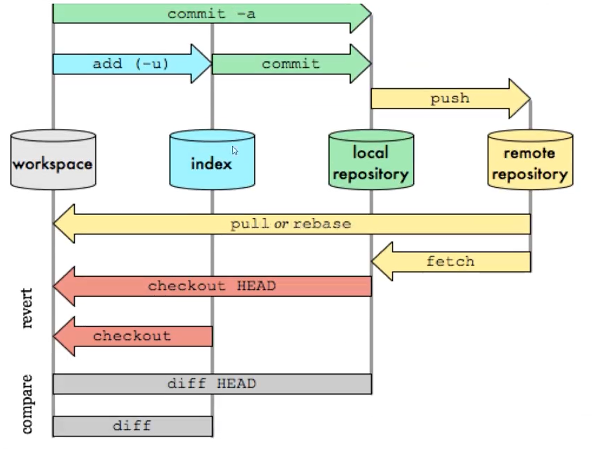
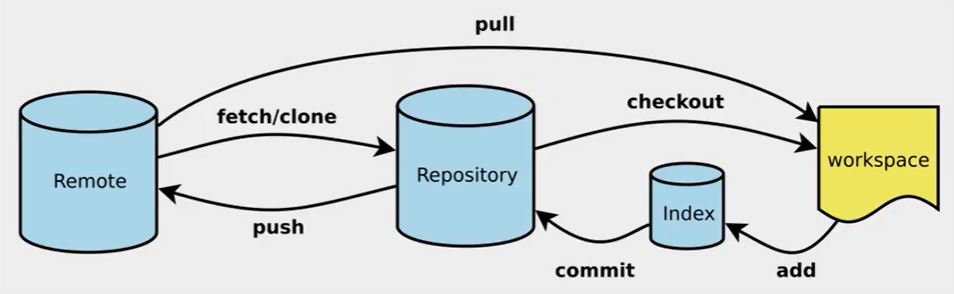
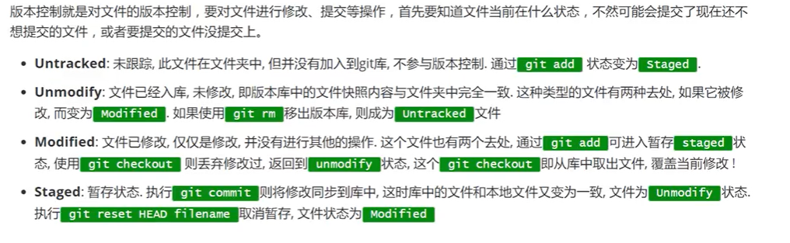
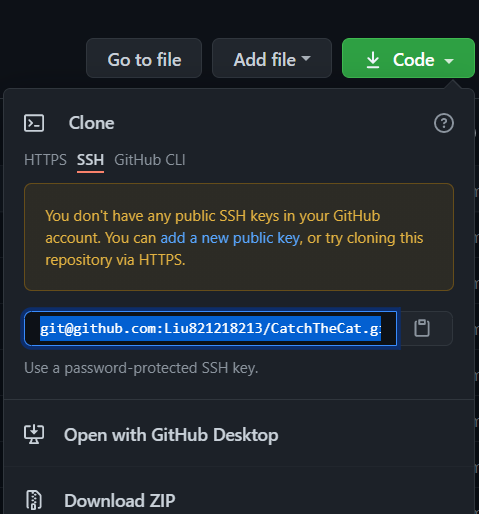
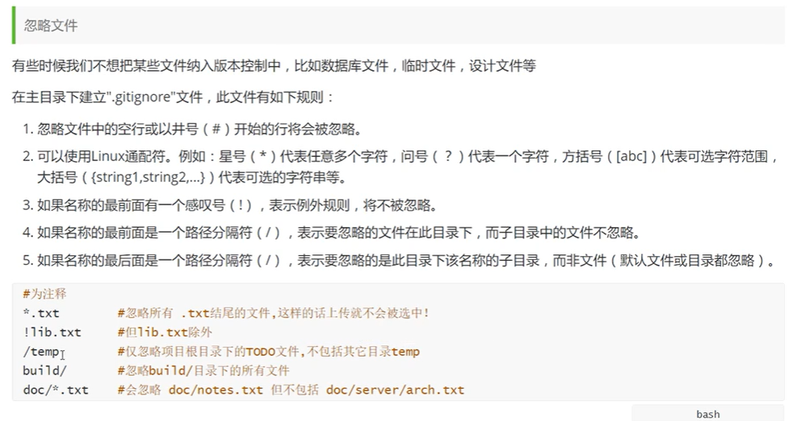

Git是一种分布式版本控制系统，可以高效地处理项目的版本管理，包括跨区域的多人协同开发，追踪和记录文件的历史记录，组织和保护源代码和文档，统计工作量，跟踪记录整个软件的开发过程。

## Git 的四个工作区域

- Remote repository：远程仓库
- Local repository：本地仓库
- index：暂存区
- workspace：工作区

### 1、远程仓库

位于托管代码的服务器，远程仓库的内容能够被分布在多个地点的处于协作关系的本地仓库修改。比起本地仓库，远程仓库通常旧一些，因此本地仓库修改完之后需要同步到远程仓库。

### 2、本地仓库

位于自己的机器，本地仓库保存了被提交过的各个版本，比起工作区和暂存区的内容，它更旧一些。

首先是 git commit 同步 index 的目录树到本地仓库，然后通过 git push 同步本地仓库到远程仓库。

### 3、暂存区

位于.git目录下的index文件，暂存区会记录 git add 添加文件的相关信息（文件名、大小），不保存文件实体，通过 id 指向每个文件的实体。

使用 git status 可以查看暂存区的状态，暂存区标记了当前工作区中哪些内容是被 git 管理的，当完成某个需求或者功能后需要提交代码，第一步就是通过 git add 先提交到暂存区。

### 4、工作区

即进行开发改动的地方，是当前看到的，内容也是最新的，平常开发就是拷贝远程仓库中的分支，基于该分支进行开发，在开发的过程就是在工作区的操作。











## Git 的工作流程

- 在工作区添加、修改文件；
- 将修改后的文件放入暂存区域 git add；
- 将暂存区域的文件提交到本地仓库 git commit；
- 将本地仓库的修改推送到远程仓库 git push。


```bash
git init # 创建.git初始化文件
git remote add origin git@github.com:文件名.git
# 将本地项目与远程项目关联起来，
```

后面的 `git@github.com:文件名.git` 是github上仓库的 “clone or download”按钮下的那个，如下图所示




```bash
git clone https://github.com/Liu821218213/CatchTheCat
# 克隆指定路径的文件到当前文件夹
# 注意如果使用了代理，需要进行对应的代理设置，否则可能无法克隆，超时
```

```bash
git status # 查看当前文件的状态
git add . # 添加所有文件到 暂存区/提交列表，或者 git add ./*
git commit -m '消息内容' # 提交暂存区中的内容到本地 仓库/head中
git push origin master
# 将改动的文件提交至远程的master分支下，master也可以换成其他分支，这样我们就可以在远程github网站看到改动的信息了
```


## Git操作

### 1.远程已经存在项目

```bash
git clone 远程地址
克隆下来之后，对代码进行修改
git add .
git commit -m '提交信息'
git push origin master
```


### 2.远程没有项目

```bash
先在远程仓库（GitHub）新建一个空白项目
再进入要提交的项目文件夹中，右键 git bash here
git init
git remote add origin git@github.com:Liu821218213/CatchTheCat.git
git add .
git commit -m '提交信息'
git push origin master
```


## SSH

github使用 https url 与使用 SSH url 的区别：

https可以随意克隆github上的项目，而不管是谁的；而SSH则是你必须是你要克隆的项目的拥有者或管理员，且需要先添加 SSH key ，否则无法克隆。

https url 在push的时候是需要验证用户名和密码的；而 SSH 在push的时候，是不需要输入用户名的，如果配置SSH key的时候设置了密码，则需要输入密码的，否则直接是不需要输入密码的。

```bash
首先 git Bash 执行如下命令
$ cd ~/.ssh
$ ls
# ~ 表示当前用户的 home 目录

$ ssh-keygen -t rsa -C "821218213@qq.com"

-t 指定密钥类型，默认是 rsa ，可以省略。
-C 设置注释文字，比如邮箱。
-f 指定密钥文件存储文件名，省略-f的话可以使用默认文件名（推荐）。

接着输入两次密码，该密码仅是push文件的时候要输入的密码，可以直接回车不需要密码。

接着回车就创建成功，出现了两个密钥文件，分别为公钥和私钥。

$ clip < ~/.ssh/id_rsa.pub
拷贝文件名为 id_rsa.pub 的内容，也可以文本文档打开手动拷贝。
之后登录Github或者其它网站，Add SSH key，可以设置别名，默认为邮箱名。

以上操作正确的话SSH基本上成功了，可以测试一下是是否成功：
$ ssh -T git@github.com
然后 yes， 输入刚刚设置的密码，出现
You've successfully authenticated 即为成功

```


## .gitignore





[github官方通用 .gitignore 文件](https://github.com/github/gitignore)

[通用的 .gitignore 文件](https://www.javastack.cn/article/2018/git-common-gitignore-file/)

```bash
## .gitignore for Grails 1.2 and 1.3

# .gitignore for maven 
target/
*.releaseBackup

# web application files
#/web-app/WEB-INF
 
# IDE support files
/.classpath
/.launch
/.project
/.settings
/*.launch
/*.tmproj
/ivy*
/eclipse
 
# default HSQL database files for production mode
/prodDb.*
 
# general HSQL database files
*Db.properties
*Db.script
 
# logs
/stacktrace.log
/test/reports
/logs
*.log
*.log.*
 
# project release file
/*.war
 
# plugin release file
/*.zip
/*.zip.sha1
 
# older plugin install locations
/plugins
/web-app/plugins
/web-app/WEB-INF/classes
 
# "temporary" build files
target/
out/
build/
 
# other
*.iws
 
#.gitignore for java
*.class
 
# Package Files #
*.jar
*.war
*.ear
 
## .gitignore for eclipse
 
*.pydevproject
.project
.metadata
bin/**
tmp/**
tmp/**/*
*.tmp
*.bak
*.swp
*~.nib
local.properties
.classpath
.settings/
.loadpath
 
# External tool builders
.externalToolBuilders/
 
# Locally stored "Eclipse launch configurations"
*.launch
 
# CDT-specific
.cproject
 
# PDT-specific
.buildpath
 
## .gitignore for intellij
 
*.iml
*.ipr
*.iws
.idea/
 
## .gitignore for linux
.*
!.gitignore
*~
 
## .gitignore for windows
 
# Windows image file caches
Thumbs.db
ehthumbs.db
 
# Folder config file
Desktop.ini
 
# Recycle Bin used on file shares
$RECYCLE.BIN/
 
## .gitignore for mac os x
 
.DS_Store
.AppleDouble
.LSOverride
Icon
 
 
# Thumbnails
._*
 
# Files that might appear on external disk
.Spotlight-V100
.Trashes

## hack for graddle wrapper
!wrapper/*.jar
!**/wrapper/*.jar
```


```bash
# Java
*.class
# Package Files
*.jar
*.war
*.ear
target/
# STS
.apt_generated
.factorypath
.springBeans
# IDEA
*.iml
*velocity.log*
*.ipr
*.iws
*.log
.classpath
.project
.settings/
.idea/
bin/
tmp/
# other
*rebel.xml*
*.lock
```

